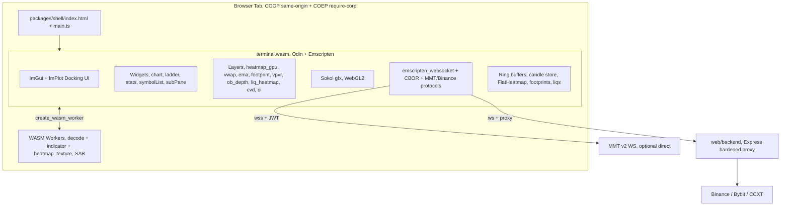

# MMT-Trade Architecture

> **Current runtime stack (Vue workers, what ships today):** [`docs/CURRENT_STACK.md`](./docs/CURRENT_STACK.md)

> Target state: full MMT.gg-style architecture — one Odin/Emscripten `terminal.wasm`
> with Sokol gfx + ImGui UI + WebSocket-in-WASM + CBOR codec + WASM workers under
> SharedArrayBuffer, served behind COOP/COEP headers.

Dieses Dokument beschreibt die **Ziel-Architektur** und die
Migrations-Phasen. Die laufende Recherche zum WS-Protokoll und zum
Terminal-Bundle liegt in [`docs/MMT_PROTOCOL.md`](./docs/MMT_PROTOCOL.md).
Der detaillierte Roadmap-Plan liegt unter
`.cursor/plans/mmt-parity-rebuild_3cfca661.plan.md`.

**Ehrliche Aufgabenliste (aus dem gesamten Chat):** [`docs/BACKLOG.md`](./docs/BACKLOG.md)

## Monorepo-Layout

```
mmt-trade/
├── packages/
│   ├── engine/                       # Odin + Emscripten terminal.wasm
│   │   ├── src/
│   │   │   ├── main.odin             # entry, RAF loop, app state
│   │   │   ├── app/                  # app shell, layout, hotkeys
│   │   │   ├── chart/                # widget_chart, candle_layer, viewport
│   │   │   ├── layers/               # heatmap_gpu, footprint, vpvr,
│   │   │   │                         #   ob_depth, liq_heatmap, vwap, ema,
│   │   │   │                         #   cvd, oi, liq, volume
│   │   │   ├── gfx/                  # sokol wrapper, shaders, colormaps
│   │   │   ├── ui/                   # cimgui panels, toolbars, modals
│   │   │   ├── net/                  # emscripten_websocket bindings,
│   │   │   │                         #   cbor, mmt_protocol, binance_protocol
│   │   │   ├── data/                 # ring buffers, FlatHeatmap, candle store
│   │   │   ├── workers/              # WASM worker entry points
│   │   │   └── util/                 # math, time, alloc, colormap
│   │   ├── vendor/                   # sokol, cimgui, imgui (pinned)
│   │   └── build.sh                  # emcc + odin → terminal.wasm/.js
│   └── shell/                        # minimal HTML/TS bootloader
│       ├── index.html                # canvas + COOP/COEP loader
│       ├── src/main.ts               # loads odin.js + terminal.wasm
│       ├── src/odin-runtime.ts       # typed wrapper around odin.js
│       └── vite.config.ts            # dev-only, sets COOP+COEP headers
├── web/
│   ├── backend/                      # Express proxy: REST + WS gateway
│   └── frontend/                     # Hybrid Vue UI — retired in Phase 6
├── docs/                             # MMT_PROTOCOL.md + captures (gitignored)
├── scripts/                          # build-wasm.sh, analyze-mmt-har.mjs, …
└── .github/workflows/                # CI: lint, typecheck, audit, build
```

## Ziel-Runtime



## Backend-Security-Modell

In `web/backend/lib/security.js` verankert. Invarianten:

- **CORS**: `CORS_ALLOWED_ORIGINS` Allow-List (kein `*` Default).
- **REST-Rate-Limit**: 120 req/min global, 30 req/min auf `/api/orderbook*`, 60 req/min auf `/api/symbols`.
- **Symbol-Validation**: `SYMBOL_REGEX` auf jeder symbol-führenden Route.
- **Timeframe-Validation**: Enum-Check gegen `TIMEFRAMES`.
- **Integer-Clamping**: `clampInteger(rawValue, default, min, max)`.
- **WebSocket-Gate**: Origin-Allow-List + max 3 Sockets/IP + `maxPayload = 64 KB`.
- **Heartbeat**: 30 s Ping, terminate nach 2 verpassten Pongs.
- **Upstream-Reconnect**: exponentielles Backoff mit Jitter, Cap bei 5 Versuchen.
- **Zero-Alloc-Book → Levels**: pre-allokierte `Float64Array`-Scratch + Object-Pool.
- **MMT-Token**: aus `MMT_WS_TOKEN`, nie in URLs geloggt.

## Performance-Budget

- 120 FPS Mainthread (Regel: `.cursor/rules/performance.mdc`).
- Zero Allocation in Render- und WS-Hot-Paths.
- WASM-Linear-Memory: 256 MB max (5 000 Kerzen + 768 OB-Spalten × 161 k Levels).
- Ein instanced Draw-Call pro Layer, sortiert nach Shader / Texture.
- WS-Decode pre-alloc in `wasm.memory.buffer` (zero-copy).

## Migrations-Phasen

| Phase | Inhalt                                                                |      Aufwand |                                                    Status                                                     |
| ----: | --------------------------------------------------------------------- | -----------: | :-----------------------------------------------------------------------------------------------------------: |
|     0 | Inventur + Cleanup, ChartWidget-Zerlegung, Doc-Konsolidierung         |    1 Session |                                                   teilweise                                                   |
|     1 | Toolchain Stop-Gate (Emscripten, Vendor, COOP/COEP, Smoke)            |    1 Session |                                                   **done**                                                    |
|     2 | Odin-Terminal-Kern (Sokol-Init, Candle-Store, Widget-Render)          | 2–3 Sessions |        **läuft** — `terminal.wasm` baut, Demo-Kerzen + MMT-Chrome (Sokol), Shell lädt unter COOP/COEP         |
|     3 | Netzwerk + Daten (WS, CBOR, MMT/Binance Protocol, Decode-Worker)      | 2–3 Sessions |                                                   skeleton                                                    |
|     4 | Layer-Parität (10 Layer + Indicator-Worker)                           | 3–4 Sessions |                                                   skeleton                                                    |
|     5 | ImGui-Docking + Widget-System (Top-Header, Tool-Rail, dockable Panes) | 2–3 Sessions | **blockiert** — `sokol_imgui.h` (HEAD) erwartet ImGui ≥1.92; Vendor pinnt 1.91.5-dock — Skeleton in `src/ui/` |
|     6 | Cutover (`web/frontend/` → `web/legacy-frontend/`, Shell als UI)      |    1 Session |                                                    pending                                                    |
|     7 | Backend-Hardening-Review (CORS, Rate-Limits, CSP, Token-Redaktion)    |    1 Session |                                                   teilweise                                                   |
|     8 | Performance-Audit (120 FPS verify, Memory, Allocation-Profiling)      |    1 Session |                                                    pending                                                    |

## Akzeptanz pro Phase

| Phase | Definition of Done                                                                                                                                   |
| ----: | ---------------------------------------------------------------------------------------------------------------------------------------------------- |
|     0 | `git status` zeigt keinen stale Klon, `ChartWidget.vue` < 300 Z. (Zerlegung in Composables), `ARCHITECTURE.md` zeigt die obige Mermaid               |
|     1 | `npm run build:engine -- --smoke` produziert ≤ 1 MB `terminal_smoke.wasm`, blaues Sokol-Triangle sichtbar, `crossOriginIsolated === true` im Browser |
|     2 | `npm run build:engine` baut, `terminal.wasm` rendert 500 Kerzen aus Sample-Bin bei 120 FPS, Maus-Pan ohne JS-Beteiligung                             |
|     3 | Mit `MMT_WS_TOKEN` gesetzt verbindet die WASM direkt mit MMT v2, dekodiert Heatmap-Frames, Backfill via `getrange` läuft                             |
|     4 | Alle 10 Layer in `packages/engine/src/layers/` rendern; ImGui-Checkbox-Toggle sofort sichtbar                                                        |
|     5 | Drag-out, Resize, Tab-Stacks, Multi-Chart funktionieren; `localStorage.terminal.ini` überlebt Reload                                                 |
|     6 | `web/frontend/` ist `web/legacy-frontend/` oder weg; `npm run dev` startet Shell + Backend                                                           |
|     7 | Keine Token in Logs, CSP-Header aktiv, OWASP-ZAP-Scan grün                                                                                           |
|     8 | DevTools-Profil: ≤ 8 ms Mainthread-Frame, 0 alloc/frame im Hot-Path                                                                                  |
