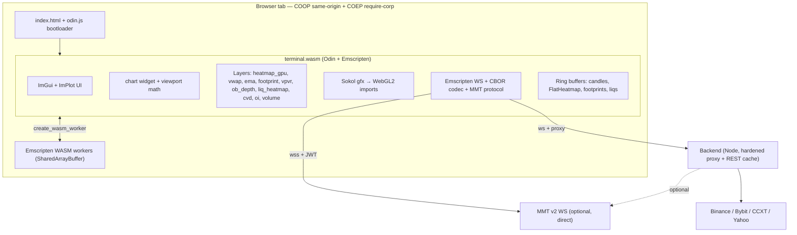

# MMT-Trade Architecture

> Target state: full MMT.gg-style architecture — one Odin/Emscripten `terminal.wasm`
> with Sokol gfx + ImGui UI + WebSocket-in-WASM + CBOR codec + WASM workers under
> SharedArrayBuffer, served behind COOP/COEP headers.

This document describes the **target architecture**. Some phases are still in
progress — see [the rewrite plan](./.cursor/plans/mmt_full_clone_rewrite_ff9f2dc3.plan.md)
for current status.

**Runtime / IPO audit (Ist-Stand):** [`docs/ARCHITECTURE.md`](./docs/ARCHITECTURE.md),
[`docs/audit/PERFORMANCE_BASELINE.md`](./docs/audit/PERFORMANCE_BASELINE.md),
[`docs/audit/MODULE_OWNERSHIP.md`](./docs/audit/MODULE_OWNERSHIP.md).

## Monorepo layout

```
mmt-trade/
├── packages/
│   ├── engine/                       # Odin/Emscripten terminal.wasm
│   │   ├── src/
│   │   │   ├── main.odin             # entry, RAF loop, app state
│   │   │   ├── app/                  # app shell, layout, hotkeys
│   │   │   ├── chart/                # widget_chart, candle_layer, viewport
│   │   │   ├── layers/               # heatmap_gpu, footprint, vpvr, ob_depth,
│   │   │   │                         #   liq_heatmap, vwap, ema, cvd, oi, volume
│   │   │   ├── gfx/                  # sokol wrapper, shaders, colormaps
│   │   │   ├── ui/                   # cimgui panels, toolbars, modals
│   │   │   ├── net/                  # emscripten_websocket bindings,
│   │   │   │                         #   cbor, mmt_protocol, binance_protocol
│   │   │   ├── data/                 # ring buffers, FlatHeatmap, candle store
│   │   │   ├── workers/              # WASM worker entry points
│   │   │   └── util/                 # math, time, alloc, colormap
│   │   ├── vendor/                   # sokol, cimgui, cimplot (pinned)
│   │   └── build.sh                  # emcc + odin → terminal.wasm/.js/odin.js
│   └── shell/                        # minimal HTML/TS bootloader
│       ├── index.html                # canvas + COOP/COEP loader
│       ├── src/main.ts               # loads odin.js + terminal.wasm
│       ├── src/odin-runtime.ts       # typed wrapper around odin.js
│       └── vite.config.ts            # dev-only, sets COOP+COEP headers
├── web/
│   ├── backend/                      # Express proxy: CCXT REST + Binance/Bybit WS
│   │   ├── index.js                  # server entry (rate-limited, validated, hardened)
│   │   └── lib/                      # security, heatmapBook, infoStream, indicators, …
│   └── frontend/                     # Legacy Vue/Vite UI — retired in Phase 7
├── docs/                             # MMT research, HAR analysis, captures (gitignored)
├── scripts/                          # build-wasm.sh, analyze-mmt-har.mjs, …
└── .github/workflows/                # CI: lint, typecheck, format, build, regression, wasm verify
```

## Hybrid architecture (Vue + Emscripten chart_runtime)

Production chart path uses a **Vue control plane** with worker-hosted rendering:

| Layer | Module | Role |
| ----- | ------ | ---- |
| Control plane | `web/frontend/src/widgets/ChartWidget.vue` | Input forward, overlay ≤10 Hz, settings bus |
| Feed hub | `web/frontend/src/workers/feedHubWorker.ts` | One `/ws/session` per tab → backend `InfoStreamMultiplexer` |
| Chart engine | `web/frontend/src/workers/chartEngineWorker.ts` | OffscreenCanvas + `engine.wasm` (candles) + optional `chart_runtime.wasm` |
| Backend MUX | `web/backend/lib/infoStream/` | Local script plots + bar stats; binary envelopes |
| Odin runtime | `packages/engine/src/main_chart.odin` | decode / indicator / texture worker entry points |

Build chart runtime: `npm run build:engine:chart` → `web/frontend/public/chart_runtime.{wasm,js}`.

Feature flags: `VITE_USE_SESSION_MUX` (default **on** unless `=0`; set in `.env.production`), `VITE_USE_EMSCRIPTEN_WORKERS=1` (set `0` to fall back to legacy `/ws/heatmap` + `obHeatmapWorker`). Session uses local provider — no JWT ([`docs/INFO_STREAM.md`](./docs/INFO_STREAM.md)).

### WASM build matrix

| Artifact | Build script | Output | Consumer |
| -------- | ------------ | ------ | -------- |
| `engine.wasm` | `npm run build:wasm` | `web/frontend/public/engine.wasm` | `chartEngineWorker.ts` (candles/VWAP/EMA) |
| `chart_runtime.wasm` | `npm run build:engine:chart` | `web/frontend/public/chart_runtime.wasm` | `chartEngineWorker.ts` (Emscripten pipeline) |
| `terminal.wasm` | `packages/engine/build.sh` | `packages/shell/public/` | `packages/shell` bootloader (target) |

CI: `node scripts/verify-wasm-artifacts.mjs` after regression tests.

COOP/COEP headers remain required for SharedArrayBuffer when Emscripten WASM workers are fully enabled.




## Backend security model

All hardened in Phase 0. Key invariants:

- **CORS**: `CORS_ALLOWED_ORIGINS` allow-list (no `*` default).
- **REST rate-limit**: 120 req/min global, 30 req/min on `/api/orderbook*`.
- **Symbol validation**: `SYMBOL_REGEX` enforced on every symbol-bearing route.
- **Timeframe validation**: enum-checked against `TIMEFRAMES`.
- **Integer clamping**: `clampInteger(rawValue, default, min, max)`.
- **WebSocket gate**: Origin allow-list + per-IP max 3 sockets + `maxPayload=64 KB`.
- **Heartbeat**: 30 s ping, terminate after 2 missed pongs.
- **Upstream reconnect**: exponential backoff with jitter, capped at 5 attempts.
- **Zero-allocation book→levels**: pre-allocated `Float64Array` scratch + object pool.
- **Session MUX**: first-party `/ws/session` — no upstream JWT; script plots computed locally.

## Performance budget

- 120 FPS main thread (rule: `.cursor/rules/performance.mdc`).
- Zero allocation in render/WS hot paths.
- WASM linear memory: 256 MB max headroom (5 000 candles + 768 OB columns × 161 k levels).
- One instanced draw call per layer; sort by shader/texture.
- WS decode pre-allocated into `wasm.memory.buffer` (zero-copy).

## Hybrid migration status (plan phases 0–4)

| Phase | Scope | Status |
| ----- | ----- | ------ |
| **0** | MUX `/ws/session`, local info stream, `chart_runtime` build, security | **Done** — `infoStream/`, `wsSession.js`, `build.sh --chart-only` |
| **1** | decode / texture / indicator workers, FeedHubWorker | **Done** — protobuf + CBOR decode in Odin; texture worker via `textureDirty` + `chart_runtime_step` |
| **2** | ChartEngineWorker, zero-Vue hot path | **Done** — MUX feed ports, dual WASM, OB layer via `obHeatmapWorker` until Sokol GPU port |
| **3** | Server indicators, BarStats stream 13 | **Done** — `create_runtime` async relay, BarStats MUX path, `scriptRuntime` lifecycle |
| **4** | Hardening, engine.wasm port, load tests | **Done** — load smoke, CI `engine-chart`, session probe, regression tests (WS smoke skips offline) |

Feature flags: `VITE_USE_SESSION_MUX`, `VITE_USE_EMSCRIPTEN_WORKERS` (see `web/frontend/.env.development`).

## Legacy migration status (terminal.wasm rewrite)

| phase                                          | status      |
| ---------------------------------------------- | ----------- |
| Phase 0: Security & Git-hygiene                | ✓ completed |
| Phase 1: Monorepo, ESLint, Prettier, CI        | ✓ completed |
| Phase 2: Emscripten + Odin toolchain           | ✓ completed |
| Phase 3–8: Full terminal.wasm monolith         | **Deferred** — hybrid chart_runtime path preferred |

## Performance budget (Phase 8 verification checklist)

| metric                                        | target           | current state                                  |
| --------------------------------------------- | ---------------- | ---------------------------------------------- |
| Main-thread FPS                               | ≥ 120 sustained  | Legacy chart hits ~60 on 4k displays; full WASM path will exceed 120 once Phase 2 toolchain is locally built |
| WASM linear memory steady state               | ≤ 200 MB         | Engine reserves 64 MiB initial, 256 MiB max (build.sh) |
| JS heap steady state                          | ≤ 200 MB         | Displayed live in the header (Chrome only)     |
| GPU buffer uploads                            | `bufferSubData` slices | `ChartRenderer` + `ObHeatmapRenderer` confirmed |
| WS decode allocations per frame               | 0                | `heatmapBook.bookToLevels` uses pre-allocated Float64Array scratch + level pool |
| Emscripten worker pool                        | 4 threads        | `-sPTHREAD_POOL_SIZE=4` in `build.sh`          |
| Crosshair / FPS sample rates                  | ≤ 10 Hz UI       | Heap sampler runs every 2 s; FPS updates per RAF |

The legacy `odin/engine.odin` (used by `web/frontend/`) continues to ship the
production WASM binary today and gets compiled by `scripts/build-wasm.sh`. The
new structured engine under `packages/engine/src/` is the rewrite target; once
Phase 4 lands and the Sokol pipeline is wired, the shell switches to it and
the legacy file is removed in Phase 7.
