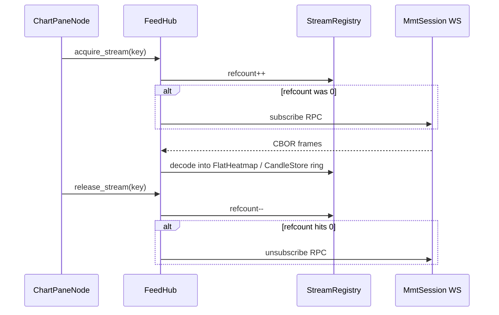

# FeedHub (shared WebSocket multiplexer)

Single data plane for all market streams and MMT script runtimes inside `terminal.wasm`.

## Stream key

```
{exchange}:{symbol}:{stream_id}:{timeframe_sec}:{bucket_group}
```

Example (aggregated heatmap, 5m):

```
binance:bitfinex:bybit:coinbase:deribit:kraken:okx:btc/usd:16:300:0
```

Matches backend [`heatmapStreamKey`](../../web/backend/lib/feeds/heatmapUpstreamManager.js) semantics extended with MMT `stream` + `bucket_group`.

## Lifecycle



## Sessions

| Session | When | Upstream |
|---------|------|----------|
| **MmtSession** | `MMT_WS_TOKEN` / JS-injected JWT | `wss://{host}/api/v2/ws?token=…` |
| **PublicSession** (later) | `HEATMAP_PUBLIC_ONLY` | Binance/Bybit via backend proxy or direct Emscripten |

Target: **≤2 WebSockets per browser tab** (one MMT + optional public fallback).

## Decode path

1. WS callback (main thread) writes frame into SAB ring → [`workers/decode_worker.odin`](../../packages/engine/src/workers/decode_worker.odin).
2. Decoder updates [`data/flat_heatmap.odin`](../../packages/engine/src/data/flat_heatmap.odin) or [`data/candle_store.odin`](../../packages/engine/src/data/candle_store.odin).
3. RAF reads rings only — no allocation on hot path.

## Transition (Vue shell)

Until `terminal.wasm` owns the canvas, the thin shell uses [`web/frontend/src/features/feed-hub/heatmapFeedHub.ts`](../../web/frontend/src/features/feed-hub/heatmapFeedHub.ts) — one `/ws/heatmap` refcount for chart OB + ladders.

## Ops

Rate limits and env: [ops/rate-limits.md](../ops/rate-limits.md).
