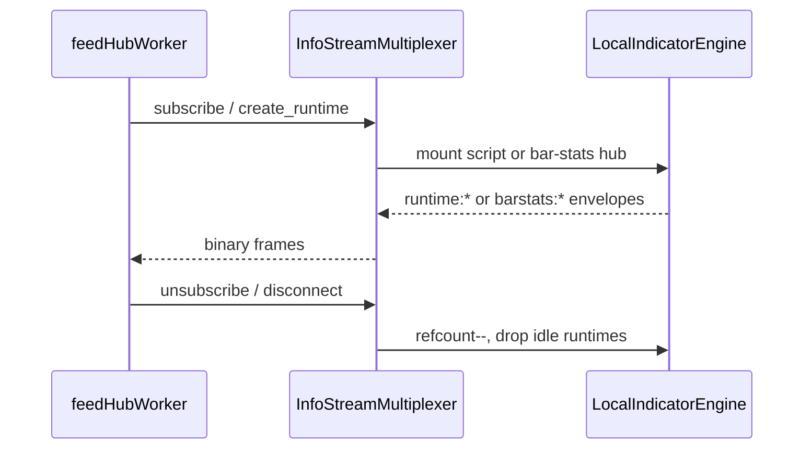

# FeedHub (shared WebSocket multiplexer)

Single data plane for script runtimes, bar stats, and (via separate socket) heatmap frames.

## Stream keys

| Stream | Key format | Socket |
|--------|------------|--------|
| Script runtime plots | `runtime:{runtime_id}` | `/ws/session` |
| Bar stats (stream 13) | `barstats:{SYMBOL}:{tfSec}:{bucketGroup}` | `/ws/session` |
| OB heatmap (stream 16) | N/A — use `/ws/heatmap` protobuf | `/ws/heatmap` |

Example bar stats key: `barstats:BTCUSDT:3600:6`

## Lifecycle (`/ws/session`)

## Sessions

| Session | Upstream | Token |
|---------|----------|-------|
| **InfoStream** | Local Node backend | None |
| **Heatmap** | Binance / Binance+Bybit aggregate | None |

Target: **≤2 WebSockets per browser tab** (`/ws/session` + `/ws/heatmap`).

## Decode path (browser)

1. `feedHubWorker` parses binary envelopes → `session_frame` / `script_plot_update`.
2. `chartEngineWorker` + `chart_runtime.wasm` handle candles / native indicators (EMA, VWAP).
3. `ChartOverlayRenderer.drawScriptPlotLines` renders horizontal script levels.

See [`INFO_STREAM.md`](../INFO_STREAM.md) for ops and JSON RPC.

## Transition (Vue shell)

Chart OB heatmap uses [`heatmapFeedHub.ts`](../../web/frontend/src/features/heatmap/feed-hub/heatmapFeedHub.ts) — always `/ws/heatmap`, independent of session MUX.

## Ops

Rate limits and env: [ops/rate-limits.md](../ops/rate-limits.md).
