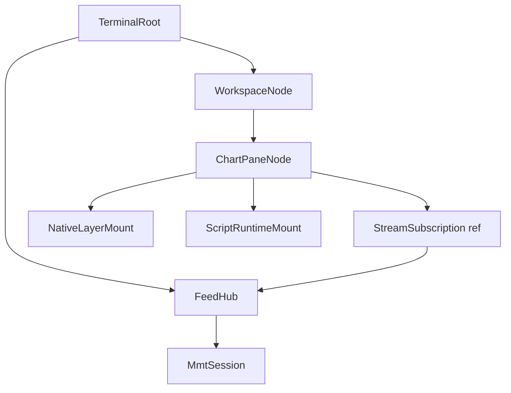

# Object tree (Odin terminal)

Normative hierarchy for the Odin-first terminal. Replaces scattered terms “indicator”, “overlay”, and “layer” in runtime code.

## Tree

## Node types

| Node | Package | Owns | Persisted |
|------|---------|------|-----------|
| `TerminalRoot` | `app/object_tree.odin` | `FeedHub`, session flags | — |
| `WorkspaceNode` | JS bridge | widget grid rects | `mmt-workspace-v1` |
| `ChartPaneNode` | `app/object_tree.odin` | symbol, TF, viewport, mount list | `WidgetState.props` |
| `StreamSubscription` | `data/stream_registry.odin` | stream key, refcount | — |
| `ScriptRuntimeMount` | `layers/script_runtime_layer.odin` | `runtime_id`, inputs | `props.runtimes[]` |
| `NativeLayerMount` | `app/state.odin` | render flag bits | layer toggles |

## Rules

1. **Market data** — `FeedHub.acquire_stream` / `release_stream`; wire = `subscribe` + `getrange` on the MMT session.
2. **Script indicators** — `create_runtime` + `update_inputs` on the **same** session; one attachment = one runtime.
3. **Symbol/TF change** — `ChartPaneNode.refresh_context` → unsubscribe old keys, subscribe new, recreate script runtimes (HAR-conform).
4. **Hidden panes** — `ChartPaneNode.set_active(false)` releases stream refs (FPS/RAM); visible again re-acquires.

## Mount types

See [mounts.md](./mounts.md) for the four mount kinds and how they map to this tree.

## Implementation

| Module | Path |
|--------|------|
| Object tree | [`packages/engine/src/app/object_tree.odin`](../../packages/engine/src/app/object_tree.odin) |
| Feed hub | [`packages/engine/src/net/feed_hub.odin`](../../packages/engine/src/net/feed_hub.odin) |
| Stream registry | [`packages/engine/src/data/stream_registry.odin`](../../packages/engine/src/data/stream_registry.odin) |
